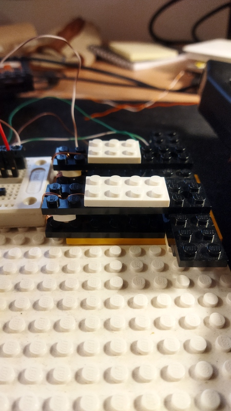
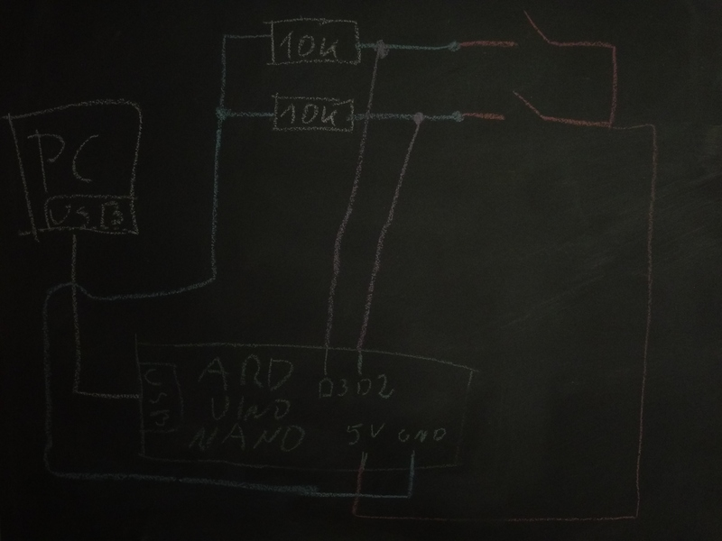

# What?

Simple toy project which shows that you may build "mechanical keyboard" out of bunch of Lego bricks and 10cm
of Ethernet wire.

# Why?

I had Arduino Nano, cable and bag of Lego bricks laying around. Isn't it enough?

# How to build?

## Lego part



Flat Lego bricks are springy. So it's possible to wind up wire on it and build mechanical switch similar to
one on the picture.

## Electronics



## Linux part

Build as any CMake based project:

```sh
mkdir build
cd build
cmake ..
make
```

## Arduino part

For now, you have to open `lego_button` sketch in Arduino IDE and upload it to your Arduino Nano. CMake support is not done yet.

#  How to run?

Connect Arduino Nano to USB and type

```
cat /dev/ttyUSB0 | ./macropad
```
